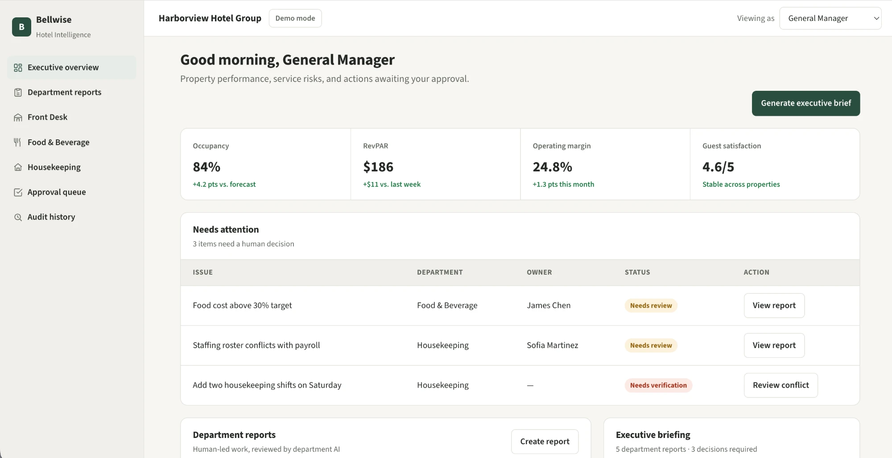
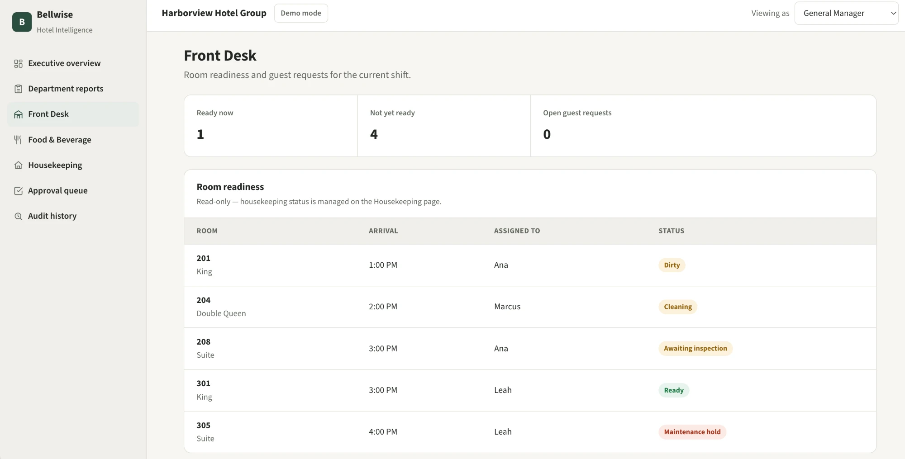
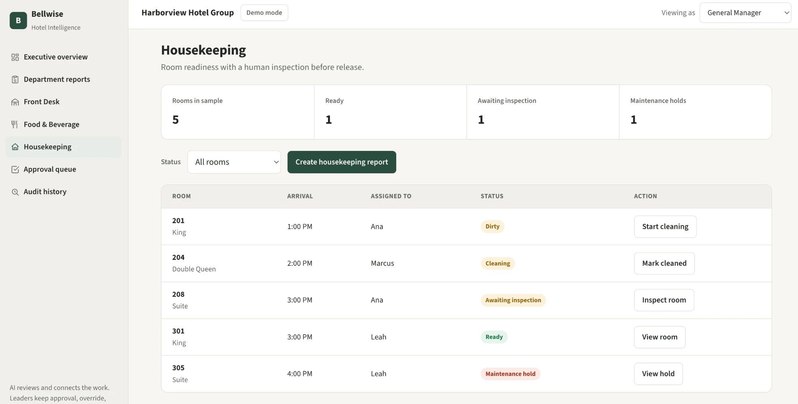
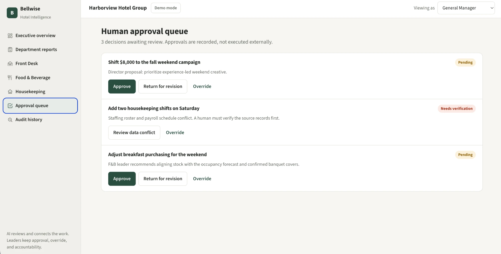

# Bellwise

**AI-assisted hotel operations with human accountability.**

Bellwise is a working hotel-operations platform prototype designed to connect departmental reporting, operational workflows, management approvals, and AI-assisted review in one system.

> **Prototype:** Bellwise currently uses synthetic hotel data and simulated AI review. It is designed to demonstrate the product concept, workflows, and user experience rather than serve as a production hotel management system.



*Executive overview showing operational performance, risks, and decisions requiring management attention.*

## Why I Built This

I built Bellwise to explore how AI-assisted workflows could improve hotel operations without removing human oversight from important decisions.

The goal was not to build a production-ready hotel management system, but to test the business concept, workflow design, and user experience behind an AI-assisted operational platform — end to end, from the initial idea through a working prototype.

I developed the concept, workflow structure, interface, and prototype myself as a hands-on way to explore how software, data, and AI could be applied to a real operational problem.

## Business Problem

Hotel operations rely on multiple departments — Front Desk, Housekeeping, Food & Beverage, marketing, and finance — that must constantly exchange information, respond to issues, and report operational performance to management. When these workflows are fragmented across separate systems, spreadsheets, messages, and manual processes, important information can be delayed or overlooked.

This kind of fragmentation is most acute for operators managing multiple departments or multiple properties — hotel chains and hotel management companies — rather than a single small property where one person already sees everything.

Bellwise explores how a centralized operational platform could organize these workflows, improve visibility across departments, and use AI-assisted review to identify issues while keeping employees and managers responsible for final decisions.

## My Role

I developed Bellwise from the initial business concept through the working prototype.

My work included:
- Defining the operational problem
- Designing the departmental workflows
- Structuring the approval and audit processes
- Designing the user experience
- Developing the working prototype
- Creating the product logic
- Exploring how AI-assisted review could be incorporated while preserving human oversight

## Product Preview

Bellwise demonstrates how operational information can move from individual departments to management while preserving human review and accountability.

### Executive Overview

The executive dashboard gives hotel leadership a consolidated view of property performance, operational risks, departmental reports, and decisions requiring attention.


### Front Desk Operations

The Front Desk workspace provides visibility into room readiness, arrivals, assignments, and guest requests while connecting operational information across departments.



### Housekeeping Workflow

The Housekeeping workspace tracks rooms through operational states such as dirty, cleaning, awaiting inspection, ready, and maintenance hold. Human inspection is required before a room can be released.



### Human Approval Queue

AI-assisted recommendations and departmental proposals can be surfaced to management, but important decisions remain under human control. Managers can approve, return for revision, investigate conflicts, or override recommendations.



## Human-in-the-Loop Design

Bellwise is designed around the idea that AI should support operational decision-making rather than replace managerial accountability.

AI-assisted processes can organize information, review departmental reports, identify potential issues, and surface recommendations. Decisions involving approvals, conflicting data, operational overrides, or important business actions remain with employees and managers.

The prototype demonstrates this through:

- Human approval queues
- Required room inspections
- Data-conflict verification
- Approve, revise, and override controls
- Recorded audit history
- Clear separation between recommendations and final decisions

This approach was designed to explore how AI could improve operational efficiency while preserving human judgment, accountability, and control.

> The current prototype simulates AI-assisted review logic for demonstration purposes. No external AI model is connected.

## Key Features

- Executive dashboard with operational KPIs and issues requiring attention
- Department-level reporting workflows
- Front Desk room-readiness visibility
- Housekeeping room-status workflow
- Mandatory human inspection before room release
- Food & Beverage operational task management
- Human approval queue
- Approve, return-for-revision, and override actions
- Data-conflict verification workflow
- Audit-history tracking
- CSV export
- Local browser persistence using localStorage
- Demo-mode reset capability

## How the Prototype Works

The prototype models a business process in this order:

1. Departments create and manage operational information.
2. Department activity is surfaced to management.
3. Simulated AI review can flag issues or recommendations.
4. Items requiring judgment are routed to a human approval workflow.
5. Managers can approve, revise, investigate, or override.
6. Actions are recorded in the audit history.

All demo state — reports, tasks, rooms, guest requests, approvals, and audit history — is stored in browser `localStorage` under the key `bellwise-demo-v1`.

- Refreshing the page preserves demo state.
- Storage is browser-specific.
- Nothing is shared between users or devices.
- The "Demo mode" button resets the sample data at any time.

## Technology / Architecture

- HTML
- CSS
- Vanilla JavaScript
- Browser `localStorage`
- Static deployment architecture
- Self-hosted fonts

```
website/
  index.html
  bellwise.css
  bellwise.js
  fonts/
```

There is no build step, no required dependencies, no package installation, and no server-side code in the current prototype.

Color tokens were checked against WCAG contrast requirements rather than assumed, and the interface supports keyboard navigation, visible focus states, and reduced-motion preferences. Details and the full rationale are in [DESIGN-SYSTEM.md](DESIGN-SYSTEM.md).

## Current Limitations

Bellwise is currently a product prototype rather than a production hotel-management platform.

The current version does not include:

- Live PMS (property management system) integration
- Live POS (point of sale) integration
- Production authentication
- Production backend services
- Multi-user synchronization
- Production database
- Live AI model integration
- Real hotel or guest data
- Enterprise security infrastructure

The current prototype uses synthetic hotel data and simulated AI-assisted review to demonstrate the intended workflows and user experience.

## Future Development

Possible next steps for this concept include:

- PMS and POS integrations
- Role-based authentication and permissions
- Backend API and shared database
- Live AI-assisted report review
- Multi-property management
- Operational analytics and trend detection
- Configurable approval rules
- Expanded audit and compliance controls
- Notification and escalation workflows
- Secure cloud deployment

None of the above has been built yet — this is a roadmap of possible directions, not committed functionality.

## Run It Locally

No build step, no dependencies, no package installation.

**Option A — open directly:**
Open `website/index.html` in any modern browser.

**Option B — local server** (recommended, avoids any browser file:// quirks):
```bash
python3 -m http.server 8000 --directory website
```
Then open http://localhost:8000.

## Hosting a Public Copy

This is a fully static site (HTML/CSS/vanilla JS, self-hosted fonts, no server-side code), so any static host works. **GitHub Pages** is the simplest option that preserves every feature, including file downloads (a sandboxed preview like a Claude Artifact blocks `<a download>` links, which would silently break the "download report" and "export audit CSV" buttons — a real static host does not have that restriction).

GitHub Pages can only serve from the repository root or a `/docs` folder, not an arbitrary subfolder like `/website`. Options to work around this:

- Add a minimal `index.html` redirect at the repo root that forwards to `/website/index.html`.
- Configure Pages to serve from a `gh-pages` branch built from the `website/` folder's contents.
- Rename or copy `website/` to `docs/` and point Pages at `/docs`.

Any other static host (Netlify, Vercel, Cloudflare Pages, a plain S3 bucket) works the same way — just point it at the `website/` folder as the publish directory. No public deployment currently exists for this repository.

## Project Structure

```
website/           the actual application (this is what you deploy)
  index.html       page shell, navigation, dialogs
  bellwise.css     design tokens and layout
  bellwise.js      data, persistence, rendering, event handling
  fonts/           self-hosted Source Sans 3 (no external font CDN at runtime)
screenshots/       product preview images used in this README
START-HERE.md      implemented-vs-planned breakdown, file notes, changelog
DESIGN-SYSTEM.md   design tokens, contrast verification, style rationale
BRIEFING.md        condensed reviewer briefing for external product review
```

## Additional Documentation

- [START-HERE.md](START-HERE.md) — implementation status, file notes, and project overview
- [DESIGN-SYSTEM.md](DESIGN-SYSTEM.md) — visual design system, tokens, and design rationale
- [BRIEFING.md](BRIEFING.md) — reviewer briefing for external product review
